# LAPORAN TUGAS BESAR PENGEMBANGAN SISTEM INFORMASI PERHOTELAN DAN OPERATIONAL CRM
## CAPELLA HOTEL & RESORT (STUDI KASUS PROYEK: ARIN-SNAP)

---

### DAFTAR ISI
DAFTAR ISI	1
BAB I	2
PENDAHULUAN	2
1.1 Latar Belakang	2
1.2 Tujuan	2
1.3 Manfaat	3
BAB II	4
ANALISIS PRODUK	4
2.1 Jenis dan Nama Produk	4
2.2 Keunggulan Produk	4
2.3 Keterkaitan Produk dengan Layanan Lain	5
BAB III	6
CUSTOMER PORTOFOLIO MANAGEMENT	6
3.1 Segmentasi Pasar	6
3.2 Target Pasar	6
3.3 Analisa Kompetitor	6
3.4 Validasi Harga	7
3.5 Strategi Pemasaran	7
3.6 Analisa SWOT	8
BAB IV	9
CUSTOMER EXPERIENCE VALUE	9
4.1 Customer Value	9
4.2 Value of Marketing (7P)	9
4.3 Pengukuran Customer Experience	10
4.4 Experience Map	10
4.4 Experience Map	12
BAB V	13
PERANCANGAN SISTEM	13
5.1 Identifikasi Aktor	13
5.2 Jenis Membership	13
5.3 Use Case Diagram	14
5.4 Antarmuka Aplikasi	14
BAB VI	23
OPERATIONAL CRM	23
6.1 Sales Automation	23
6.2 Marketing Automation	23
6.2.1 Online Marketing	23
6.2.2 Personalisasi & Loyalitas	23
6.3 Service Automation	23

---

## BAB I 
## PENDAHULUAN

### 1.1 Latar Belakang
Perkembangan pesat teknologi informasi di era digital telah merombak ekspektasi konsumen dalam industri *hospitality* dan perhotelan mewah. Pengunjung modern tidak lagi hanya menilai kualitas sebuah resor dari kemegahan fisik bangunan atau keindahan kamarnya, tetapi juga dari seberapa mulus, cepat, dan transparan interaksi digital yang mereka rasakan sejak pertama kali mencari informasi akomodasi hingga masa menginap berakhir. Kebutuhan akan reservasi mandiri (*self-service booking*) yang instan, kepastian status pemesanan yang dapat dipantau langsung dari ponsel, penghargaan atas kesetiaan (*loyalty rewards*), serta ketersediaan layanan bantuan 24 jam telah menjadi standar baru bagi wisatawan kelas atas.

Di sisi lain, pengelola hotel sering kali dihadapkan pada kendala manajerial akibat penggunaan sistem konvensional yang terpisah-pisah (*siloed systems*). Data reservasi kamar, catatan identitas dan preferensi tamu, stok perlengkapan kamar (*amenities & inventory*), hingga pemantauan ulasan kepuasan pelanggan kerap dikelola melalui *database* atau lembar kerja yang berbeda. Hal ini menyebabkan staf administrasi kesulitan mendapatkan visibilitas bisnis secara *real-time*, memperlambat proses validasi pesanan, dan menghambat penerapan pelayanan yang bersifat personal.

Sebagai solusi atas kesenjangan operasional dan pelayanan tersebut, penerapan *Customer Relationship Management* (CRM) terintegrasi berbasis *cloud* menjadi kunci strategis. CRM tidak hanya berfungsi sebagai alat pencatatan transaksi, melainkan sebagai ekosistem pintar yang merawat hubungan jangka panjang dengan tamu melalui otomatisasi pemasaran, pengenalan profil perilaku pelanggan, dan percepatan penanganan keluhan.

Bertolak dari urgensi tersebut, proyek **arin-snap** ini merancang dan membangun **Capella Hotel & Resort**, sebuah platform digital perhotelan terpadu dan sistem *Operational CRM* berbasis web. Aplikasi ini dikembangkan dengan arsitektur *Full-Stack Serverless* modern menggunakan **React 19**, **Vite**, **Tailwind CSS v4**, dan **Supabase** sebagai pusat data (*backend database*). Proyek ini secara khusus mengunggulkan pemisahan alur navigasi (*strict routing*) yang membagi akses antara portal pengunjung publik (*pre-login Landing Page* dengan *interactive modal popups*), portal pemesanan dan loyalitas bagi member (*Member Portal* & *Capella Rewards*), serta pusat komando operasional bagi staf hotel (*Admin Dashboard, Bookings, Guests CRM, Inventory, & Reviews*), yang seluruhnya didukung oleh kehadiran asisten virtual AI interaktif (**SAHAJA AI**).

### 1.2 Tujuan
1. **Membangun Platform Manajemen Akomodasi Terintegrasi:** Merancang aplikasi web yang menghubungkan alur pemesanan kamar mandiri oleh tamu (*Member Portal*) dengan panel pengawasan operasional dan inventaris oleh staf (*Admin Portal*) dalam satu *database* terpusat Supabase.
2. **Menerapkan Modul Operational CRM:** Mengimplementasikan otomatisasi pada tiga pilar utama CRM, yaitu *Sales Automation* (kalkulasi harga dan diskon otomatis), *Marketing Automation* (personalisasi tampilan dan penawaran dinamis), dan *Service Automation* (layanan mandiri status reservasi dan chatbot 24/7).
3. **Mengembangkan Sistem Loyalitas Berbasis Tier (*Capella Tier Engine*):** Merancang program **Capella Rewards** berjenjang (*Bronze, Silver, Gold, dan Platinum*) yang secara dinamis menghitung akumulasi poin dari pengeluaran dan frekuensi reservasi tamu untuk mengunci retensi pelanggan.
4. **Menyediakan Pusat Analitik Bisnis Real-Time bagi Admin:** Menghadirkan *dashboard* interaktif visual (`Dashboard.jsx`) yang memetakan statistik pendapatan, tingkat okupansi, dan efektivitas pemasaran guna mendukung pengambilan keputusan manajemen hotel.

### 1.3 Manfaat

**(1) Bagi Tamu / Member:**
- **Kemandirian dan Kecepatan Reservasi (*Frictionless Self-Service Booking*):** Tamu dapat langsung memilih kamar mewah pilihan (*Ocean Suite, Heritage Pavilion, atau Skyline Penthouse*), menentukan tanggal *check-in/check-out*, dan melihat rincian kalkulasi harga akhir yang otomatis dipotong diskon keanggotaan.
- **Transparansi Siklus Reservasi:** Tamu memperoleh kepastian status pesanan mereka secara waktu nyata (*Pending, Confirmed, Checked-In, atau Checked-Out*) langsung dari layar *dashboard* akun tanpa perlu repot menelpon *Front Office*.
- **Apresiasi Kesetiaan yang Nyata (*Capella Rewards*):** Setiap rupiah yang dibelanjakan dikonversi menjadi poin loyalitas yang dapat dilacak melalui *progress bar*, memberikan keuntungan langsung berupa diskon kamar hingga 20%, *priority check-in*, hingga *free room upgrade*.
- **Akses Informasi Instan Tanpa Batas Waktu:** Kehadiran asisten virtual **SAHAJA AI** memastikan calon tamu maupun member mendapatkan jawaban instan terkait fasilitas, kebijakan hotel, dan harga kamar kapan saja selama 24 jam.

**(2) Bagi Admin / Pengelola Hotel:**
- **Efisiensi Validasi dan Sentralisasi Database:** Seluruh pesanan yang masuk otomatis teregistrasi di Supabase dan staf cukup melakukan satu klik pada *dropdown* status di menu `Bookings.jsx` untuk memproses reservasi dari pending hingga selesai menginap.
- **Kendali Finansial dan Okupansi Real-Time:** Manajemen dapat memantau performa bisnis harian melalui visualisasi grafik pendapatan (*Revenue Chart*), statistik pengunjung (*Visitor Chart*), dan kartu indikator performa utama (*StatCards*).
- **Pengawasan Inventaris dan Aset Kamar yang Akurat:** Menu `Inventory.jsx` memudahkan admin memantau ketersediaan stok barang pelengkap kamar (*Amenities, Minibar, Extra Bed, hingga perlengkapan Pro Series*) beserta harga tambahannya secara rapi.
- **Evaluasi Reputasi Berbasis Ulasan Langsung (*Closed-Loop Review*):** Admin dapat meninjau seluruh *rating* bintang dan ulasan yang dikirimkan tamu pasca-menginap melalui `AdminReviews.jsx` sebagai dasar perbaikan standar kualitas pelayanan staf.

---

## BAB II 
## ANALISIS PRODUK

### 2.1 Jenis dan Nama Produk
- **Jenis Usaha / Produk:** Layanan Akomodasi Perhotelan Mewah dan Manajemen Hospitalitas (*Hospitality Service & Luxury Hotel Management*)
- **Nama Usaha / Brand:** **Capella Hotel & Resort** *(Identitas Proyek: arin-snap)*

### 2.2 Keunggulan Produk
Capella Hotel & Resort dalam proyek **arin-snap** ini memiliki keunggulan komparatif pada perpaduan estetika visual bermutu tinggi dengan kecanggihan arsitektur logika sistemnya. Dari segi presentasi antarmuka, aplikasi ini menerapkan rancangan *luxury minimalist editorial style* khas resor kelas dunia—menggunakan kombinasi tipografi serif italic elegan dengan aksen warna hangat *Amber/Orange* (`#F5A623`), *Teal*, serta tata letak *Dark/Light Mode* yang konsisten. Hal ini memberikan impresi eksklusif dan memukau bagi setiap pengunjung yang mengakses *Landing Page*.

Dari segi keunggulan teknis dan fitur, proyek ini menonjol melalui:
1. **Strict Guest & Member Route Splitting:** Halaman *Landing Page* (`LandingPage.jsx`) didesain murni sebagai area publik penyambutan dan eksplorasi. Sistem memiliki logika proteksi di mana pengguna yang sudah masuk (*login*) akan otomatis dialihkan langsung ke portal masing-masing (`MemberPortal` atau `Dashboard` admin), sehingga alur navigasi tidak tumpang tindih.
2. **Interactive Portal Modals:** Seluruh penawaran pada *Landing Page* (seperti *Enhance Your Stay*, *Curated Offers*, dan *Capella Boutique*) dilengkapi dengan *popup modal interaktif*. Pengunjung dapat melihat rincian harga serta spesifikasi kamar/barang hanya dengan mengklik kartu penawaran tanpa harus meninggalkan halaman utama.
3. **Automated Tier & Discount Engine:** Sistem tidak sekadar menyimpan profil tamu, melainkan memiliki algoritma pintar di dalam `MemberPortal.jsx` dan `Rewards.jsx` yang secara otomatis menghitung *tier* keanggotaan berdasarkan riwayat transaksi total dan jumlah kunjungan, langsung mengalikan diskon (5%–20%) pada saat member memesan kamar.
4. **Asisten Virtual SAHAJA AI:** Integrasi *chatbot* cerdas bergaya *floating modal* yang siap mendampingi tamu mengeksplorasi layanan resor 24/7.

### 2.3 Keterkaitan Produk dengan Layanan Lain
Ekosistem layanan Capella Hotel dirancang saling berkaitan antara layanan akomodasi utama dengan modul pendukung operasional yang dikelola oleh staf (*Cross-Module Ecosystem*):

1. **Layanan Akomodasi Kamar (*Luxury Room Services*):**
   - **Capella Luxury Ocean Suite** *(Bali, Indonesia)* — Tarif dasar: `Rp 3.500.000 / malam` *(Menawarkan pemandangan samudra dan ruang tamu mewah)*
   - **Heritage Valley Pavilion** *(Ubud, Bali)* — Tarif dasar: `Rp 2.800.000 / malam` *(Menonjolkan arsitektur tradisional di tengah ketenangan lembah Ubud)*
   - **Urban Skyline Penthouse** *(Jakarta, Indonesia)* — Tarif dasar: `Rp 4.200.000 / malam` *(Akomodasi eksekutif di puncak gedung pusat kota)*

2. **Fasilitas dan Layanan Resor (*Resort Facilities & Wellness*):**
   - *The Auriga Holistic Spa & Wellness Center*
   - *Capella Infinity Pool & Private Cabanas*
   - *Madulance & Fine Dining Restaurant*
   - *24-Hour Fitness Center & Private Valet*

3. **Inventaris dan Fasilitas Tambahan Kamar (*Inventory Items & Add-ons*):**
   - *Ergonomic Pillow & Welcome Fruit Basket* *(Fasilitas Complimentary / dipantau stoknya di tabel Inventory)*
   - *Folding Extra Bed* — Harga tambahan: `$35`
   - *Premium Minibar Snacks* — Harga tambahan: `$15`
   - *Hair Dryer Pro Series & Luxury Toiletries*

4. **Program Loyalitas dan Penukaran Hadiah (*Capella Rewards CRM*):**
   - Terhubung langsung dengan basis data pemesanan. Ketika admin merubah status reservasi di `Bookings.jsx` menjadi *Confirmed* atau *Checked-Out*, nilai transaksi otomatis menyumbang akumulasi poin pada dompet member untuk ditukarkan dengan *voucher fine dining* atau *room upgrade*.

---

## BAB III 
## CUSTOMER PORTOFOLIO MANAGEMENT

### 3.1 Segmentasi Pasar
- **Segmentasi Demografis:** Menargetkan eksekutif bisnis (*Corporate Professionals*), pasangan yang merayakan bulan madu atau ulang tahun pernikahan (*Honeymooners & Couples*), serta keluarga kelas atas (*Affluent Families*) dalam rentang usia 25 hingga 60 tahun dengan tingkat pendapatan menengah ke atas.
- **Segmentasi Geografis:** Berfokus pada pasar wisatawan domestik dan internasional yang mencari akomodasi premium di destinasi unggulan Indonesia, khususnya area Bali (Nusa Dua & Ubud) serta pusat bisnis kota Metropolitan Jakarta.
- **Segmentasi Psikografis:** Kelompok konsumen yang mengutamakan privasi, kenyamanan tinggi, pelayanan personal, serta memiliki literasi digital yang baik (*tech-savvy*) sehingga menyukai kemudahan proses *self-service booking* serta apresiasi atas status keanggotaan mereka.

### 3.2 Target Pasar
1. **Wisatawan Eksekutif Bisnis:** Membutuhkan kepastian jadwal *check-in*, kecepatan reservasi tanpa antrean panjang, dan transparansi invoice digital yang dapat diakses mandiri di `MemberPortal.jsx`.
2. **Pasangan / Wisatawan Leisure (*Romantic & Getaway Seekers*):** Ditargetkan melalui penawaran kamar *Capella Luxury Ocean Suite* dan *Heritage Valley Pavilion* yang dilengkapi layanan spa dan *fine dining* romantis.
3. **Pelanggan Setia / Tamu Berulang (*Repeat Loyalty Guests*):** Segmen paling krusial dalam strategi CRM Capella. Melalui insentif *Capella Rewards*, tamu dirangsang untuk terus memilih Capella sebagai penginapan langganan guna memperoleh benefit tier *Gold* dan *Platinum*.

### 3.3 Analisa Kompetitor

| Kompetitor | Kelebihan Kompetitor | Kelemahan Kompetitor | Keunggulan Kompetitif Capella Hotel (*Project arin-snap*) |
| :--- | :--- | :--- | :--- |
| **Hotel Indonesia Kempinski** | Brand internasional legendaris, fasilitas bangunan berkelas dunia di lokasi super strategis di jantung kota. | Tarif kamar sangat tinggi, serta portal keanggotaan digital sering kali kurang interaktif bagi tamu untuk mengecek simulasi poin secara mandiri. | Menawarkan kemewahan pelayanan sekelas bintang lima namun didukung platform web modern yang memberikan **kalkulasi diskon otomatis dan simulasi progres tier** secara visual dan transparan. |
| **The Ritz-Carlton Jakarta** | Standar *hospitality* dan keramahan staf yang sangat terkenal di seluruh dunia. | Alur reservasi digital di situs web masih cenderung formal-birokratis dan kurang menonjolkan fitur interaksi cepat 24 jam. | Menghadirkan **SAHAJA AI** bergaya *floating chat* serta *interactive popup modals* di halaman utama yang membuat eksplorasi kamar terasa instan. |
| **OTA (Traveloka, Booking.com, Agoda)** | Pilihan hotel sangat masif, fitur perbandingan harga cepat, serta promosi/diskon agresif lintas jaringan. | Data identitas dan riwayat tamu dikuasai oleh pihak OTA (bukan hotel), sehingga hotel kehilangan kontak langsung (*Direct CRM*) dengan tamunya. | Membangun ekosistem **Direct-to-Consumer (D2C) CRM**, di mana data riwayat tamu dimiliki langsung oleh hotel dan member mendapat insentif poin jauh lebih besar dibanding *booking* via pihak ketiga. |
| **Hotel Bintang 3–4 Lokal** | Harga relatif terjangkau dan memiliki banyak cabang di berbagai kota. | Kualitas fasilitas terbatas, tidak memiliki sistem *tier* loyalitas berjenjang, dan manajemen data kamar/tamu masih terfragmentasi. | Unggul mutlak dalam kemewahan fasilitas (*Ocean Suite/Penthouse*) serta kelengkapan modul *Operational CRM* admin yang terpusat. |

### 3.4 Validasi Harga
Penetapan struktur harga pada proyek Capella dirancang berdasarkan nilai kemewahan dan eksklusivitas layanan (*Value-Based Pricing*), namun tetap rasional untuk pasar akomodasi bintang lima Indonesia:
- **Capella Luxury Ocean Suite:** `Rp 3.500.000 / malam` *(Fokus pada keindahan panorama laut & interior suite luas)*
- **Heritage Valley Pavilion:** `Rp 2.800.000 / malam` *(Fokus pada keasrian alam dan arsitektur bali di Ubud)*
- **Urban Skyline Penthouse:** `Rp 4.200.000 / malam` *(Fokus pada kemewahan penthouse di pusat bisnis Jakarta)*
- **Tarif Fasilitas Tambahan (*Add-on Inventory*):** *Folding Extra Bed* (`$35`), *Premium Minibar Snacks* (`$15`).

### 3.5 Strategi Pemasaran
1. **Pemasaran Visual & Storytelling Digital (*Editorial Brand Presence*):** Memanfaatkan desain `LandingPage.jsx` dengan *parallax banner*, seksi *About & Gallery* bertema minimalis mewah, serta *interactive modal popups* untuk memikat pengunjung sejak detik pertama.
2. **Retensi Berbasis Tier Loyalitas (*Tier-Driven Retention Marketing*):** Menggunakan **Capella Rewards** sebagai magnet utama retensi. Tamu didorong untuk mendaftar akun karena sistem langsung memberikan harga khusus member (potongan 5% untuk *Bronze* hingga 20% untuk *Platinum*).
3. **Ekosistem Ulasan Terbuka (*Social Proof & Closed-Loop Feedback*):** Menampilkan ulasan autentik tamu di halaman utama sebagai bukti kualitas layanan. Di sisi lain, ulasan tersebut masuk ke menu `AdminReviews.jsx` agar staf dapat langsung mengevaluasi performa pelayanan.
4. **Validasi Kemitraan Global (*Marquee Partner Display*):** Menampilkan logo mitra distribusi internasional (*Booking.com, Expedia, Traveloka, Agoda*) pada halaman utama untuk membangun kepercayaan cepat bagi calon tamu baru.

### 3.6 Analisa SWOT
- **Strengths (Kekuatan):**
  - Menggunakan *tech stack* terkini (*React 19, Tailwind CSS v4, Supabase*) yang menjamin kecepatan pemuatan halaman dan keamanan data.
  - Integrasi penuh 5 modul operasional hotel dalam satu dasbor: *Reservasi, Data Tamu, Inventaris Kamar, Ulasan, dan Loyalitas*.
  - Desain UI/UX bergaya *luxury editorial* yang memukau dan keberadaan asisten virtual SAHAJA AI.
- **Weaknesses (Kelemahan):**
  - Perubahan status reservasi dari *Pending* menjadi *Confirmed* masih membutuhkan verifikasi dan klik manual dari admin di halaman `Bookings.jsx`.
  - Simulasi pembayaran belum dihubungkan secara *live* dengan *payment gateway* perbankan riil (seperti Midtrans/Xendit).
- **Opportunities (Peluang):**
  - Data analitik pada `Dashboard.jsx` dapat dikembangkan lebih lanjut menjadi fitur promosi personal berbasis *Machine Learning* (*AI-driven Personalized Email Offers*).
  - Ekspansi kerja sama penukaran poin *Capella Rewards* dengan maskapai penerbangan (*frequent flyer*) atau restoran *fine dining* eksternal.
- **Threats (Ancaman):**
  - Perang diskon agresif dari platform OTA besar yang berpotensi merebut calon tamu dari saluran pemesanan langsung (*direct booking*).
  - Risiko serangan siber (*data breach*) pada *database* tamu yang menuntut pemeliharaan protokol keamanan Supabase secara rutin.

---

## BAB IV 
## CUSTOMER EXPERIENCE VALUE

### 4.1 Customer Value
- **Nilai Fungsional (*Functional Value*):** Tamu memperoleh kemudahan mutlak dalam mencari kamar, mengecek estimasi harga secara akurat, dan memesan akomodasi tanpa hambatan birokrasi. Sistem yang responsif dan bebas *bug* memberikan efisiensi waktu serta kepastian status pesanan.
- **Nilai Emosional (*Emotional Value*):** Tamu merasakan pengalaman pelayanan kelas atas yang menghargai status mereka (*VIP Recognition*). Sapaan nama di *PageHeader*, penanda status keanggotaan (misalnya *Platinum Member - VIP Upgrade*), serta kemudahan menukarkan poin dengan hadiah memberi kebanggaan tersendiri bagi member.

### 4.2 Value of Marketing (7P)
1. **Product (Produk):** Akomodasi kamar mewah (*Ocean Suite, Valley Pavilion, Skyline Penthouse*), fasilitas resor bintang lima (*Spa, Pool, Dining*), serta program penghargaan *Capella Rewards*.
2. **Place (Tempat/Saluran):** Platform web aplikasi yang dapat diakses 24 jam via desktop maupun ponsel cerdas, serta properti fisik resor di Bali dan Jakarta.
3. **Price (Harga):** Tarif kamar berjenjang (`Rp 2,8 Juta – Rp 4,2 Juta`) yang didukung oleh struktur potongan harga otomatis berbasis *tier membership* (5% hingga 20%).
4. **Promotion (Promosi):** *Landing Page* bergaya editorial, *modal popup* penawaran eksklusif, paket liburan tematik, serta insentif akumulasi poin loyalitas.
5. **People (SDM/Staf):** Tim admin dan resepsionis hotel yang tanggap dalam mengelola data di *Admin Portal*, dibantu oleh asisten virtual SAHAJA AI yang siap 24/7.
6. **Process (Proses):** Alur pemesanan yang ringkas: *Eksplorasi Landing Page $\rightarrow$ Login/Register $\rightarrow$ Pilih Kamar di Member Portal $\rightarrow$ Klik Booking Modal $\rightarrow$ Admin Validasi Status di Bookings.jsx $\rightarrow$ Check-In/Out $\rightarrow$ Poin Cair & Tulis Ulasan*.
7. **Physical Evidence (Bukti Fisik):** Tampilan visual antarmuka web berpalet *Teal-Gold* yang elegan, riwayat bukti pemesanan digital di dasbor member, serta kemewahan nyata fasilitas kamar resor di lapangan.

### 4.3 Pengukuran Customer Experience

| Kategori Metrik | Parameter Pengukuran di Capella Hotel (`arin-snap`) | Tujuan Evaluasi Manajemen |
| :--- | :--- | :--- |
| **Involvement (Keterlibatan)** | Durasi kunjungan pengguna pada `LandingPage.jsx`, interaksi mengklik tombol *Interactive Modal Popup* di seksi penawaran, serta eksplorasi galeri kamar. | Menilai efektivitas desain visual dan daya tarik penawaran kamar dalam memikat perhatian awal calon tamu. |
| **Interaction (Interaksi)** | Volume percakapan yang masuk melalui **SAHAJA AI**, penggunaan *filter* kamar di `MemberPortal.jsx`, serta pengisian form reservasi pada *Booking Modal*. | Menguji kemudahan navigasi antarmuka (*usability*) dan kelancaran alur pemesanan mandiri oleh pengguna. |
| **Intimacy (Kedekatan)** | Tingkat reservasi ulang (*repeat booking rate*), persentase member yang berhasil naik kelas dari *Bronze* ke *Gold/Platinum*, serta penukaran poin di `Rewards.jsx`. | Mengukur efektivitas program *Operational CRM* dalam mengunci loyalitas jangka panjang tamu terhadap resor. |
| **Influence (Pengaruh)** | Skor rata-rata *rating* bintang (1–5) dan analisis sentimen komentar pada `AdminReviews.jsx`, serta tingkat ulasan positif yang tampil di halaman depan. | Menjadi barometer utama atas kepuasan nyata tamu sekaligus bahan refleksi untuk peningkatan standar kerja staf. |

### 4.4 Experience Map

#### A. Pemetaan Pengalaman Tamu Saat Menggunakan Layanan Capella Secara Utuh

```mermaid
stateDiagram-v2
    [*] --> LoginRegister : Masuk / Daftar Akun (`Login.jsx`)
    LoginRegister --> LihatKatalog : Melihat Katalog Kamar & Fasilitas (`LandingPage` / `MemberPortal`)
    LihatKatalog --> LihatUlasan : Melihat Ulasan Tamu Lain (`Reviews`)
    LihatUlasan --> PilihTanggal : Memilih Tanggal Check-in / Check-out (`Self-Service Booking Modal`)
    PilihTanggal --> BookingKamar : Booking Kamar (Kalkulasi Diskon Tier Otomatis)
    BookingKamar --> KonfirmasiStatus : Konfirmasi Status Booking (Masuk ke Database Supabase)
    KonfirmasiStatus --> MenungguAdmin : Status "Pending" (Menunggu Validasi Admin di `Bookings.jsx`)
    MenungguAdmin --> CheckInHotel : Status "Confirmed" -> Check-in di Resor Capella
    CheckInHotel --> Menginap : Menikmati Masa Menginap & Fasilitas Tambahan (`Inventory`)
    Menginap --> MemberiUlasan : Status "Checked-Out" -> Memberi Ulasan (`AdminReviews`)
    MemberiUlasan --> PoinBertambah : Poin Capella Rewards Otomatis Bertambah (`Rewards.jsx`)
    PoinBertambah --> TukarPoin : Menukar Poin di Katalog Hadiah (Voucher Dining / Spa / Upgrade)
    TukarPoin --> [*]
```

**Proses yang dilakukan saat booking:**
- Tamu memilih tanggal *check-in* dan *check-out*, sistem secara otomatis menghitung jumlah durasi malam dan estimasi total biaya (sekaligus mengalikan potongan harga otomatis berdasarkan *Tier Membership* pada `MemberPortal.jsx`).
- Tamu mengonfirmasi reservasi melalui *Self-Service Booking Modal*, di mana status pesanan awal teregistrasi di database Supabase sebagai `"Pending"` hingga divalidasi oleh admin melalui menu `Bookings.jsx` menjadi `"Confirmed"`.
- Setelah masa menginap selesai, admin memperbarui status menjadi `"Checked-Out"` dan poin loyalitas (*Capella Rewards*) secara otomatis ditambahkan ke dompet saldo akun tamu.

**Skill, pengetahuan, dan sikap karyawan yang dibutuhkan oleh:**
- **Kemampuan Komunikasi & Interaktivitas:** Keterampilan komunikasi yang ramah, empatik, dan responsif dalam menangani pertanyaan tamu, baik melalui pendampingan asisten virtual **SAHAJA AI** maupun interaksi langsung di *Front Office*.
- **Ketelitian & Kecepatan Operasional Admin:** Ketelitian tinggi staf dalam memonitor pembaruan status reservasi di `Bookings.jsx` serta sinkronisasi ketersediaan kamar dan perlengkapan inventaris (`Inventory.jsx`) secara *real-time*.
- **Penguasaan Logika Produk & Loyalitas:** Pemahaman mendalam terhadap mekanisme program **Capella Rewards** (*tier Bronze, Silver, Gold, Platinum*) dan syarat penukaran poin (`Rewards.jsx`) guna membantu member mengoptimalkan benefit eksklusif mereka.

---

### 4.4 Experience Map

Tabel berikut memetakan perjalanan pengalaman tamu (*Customer Experience Map*) secara menyeluruh dari tahap eksplorasi awal hingga menjadi pelanggan loyal di ekosistem Capella Hotel (`arin-snap`):

| Fase | Actions (Tindakan Tamu) | Customer Thought (Pemikiran Tamu) | Touchpoint (Titik Interaksi) |
| :--- | :--- | :--- | :--- |
| **1. Discovery (Penemuan)** | Mengunjungi `LandingPage.jsx`, mengamati *Hero Banner* bergaya editorial, serta mengklik kartu *Curated Offers* dan *Capella Boutique* untuk membuka *Interactive Modal Popup*. | *"Desain web resor ini sangat mewah dan informatif. Spesifikasi kamar di popup-nya jelas, apakah tarifnya sesuai dengan anggaran liburan saya?"* | *Landing Page, Parallax Hero, Interactive Modal Popups, Marquee Partner OTA.* |
| **2. Consideration (Pertimbangan)** | Mempelajari fasilitas resor (*Holistic Spa, Pool, Dining*), membaca ulasan tamu lain, dan membuka obrolan dengan **SAHAJA AI** untuk bertanya mengenai ketersediaan kamar. | *"Saya sangat tertarik dengan Capella Luxury Ocean Suite. Kalau saya mendaftar akun member sekarang, apakah saya langsung dapat diskon khusus?"* | *SAHAJA AI Floating Chatbot, Facilities Section, Testimonials & Reviews Grid.* |
| **3. Purchase (Pemesanan)** | Mendaftar/masuk melalui `Login.jsx` (Tab Member), membuka `MemberPortal.jsx`, memilih kamar *Ocean Suite / Pavilion*, mengisi tanggal *check-in*, dan menekan tombol pemesanan. | *"Proses pesannya sangat cepat, sistem langsung memotong harga dengan diskon tier member saya. Semoga staf front office segera mengonfirmasi pesanan ini."* | *Halaman Login/Register, Member Portal, Self-Service Booking Modal, kalkulator harga.* |
| **4. Experience (Menginap)** | Staf mengonfirmasi pesanan (`Confirmed`). Tamu tiba di resor, menikmati kamar dan memesan fasilitas tambahan (*Folding Extra Bed / Minibar*) yang dicatat di inventaris. | *"Pelayanan resor sangat konsisten dengan apa yang ada di aplikasi. Kamar bersih, fasilitas mewah, dan status booking saya terdata rapi."* | *Admin Portal (menu Bookings.jsx), Resepsionis Front Office, Kamar & Fasilitas Resor.* |
| **5. Retention (Loyalitas)** | Masa menginap selesai (`Checked-Out`). Poin *Capella Rewards* otomatis bertambah. Tamu menulis ulasan 5 bintang di aplikasi dan mengecek katalog penukaran hadiah di `Rewards.jsx`. | *"Poin saya bertambah dan sebentar lagi naik ke tier Gold! Saya pasti akan menginap di sini lagi saat liburan berikutnya untuk menukarkan voucher spa."* | *Member Portal (`Rewards.jsx`), Progress Bar Loyalty Tier, Form Ulasan Pasca-Menginap.* |

---

## BAB V 
## PERANCANGAN SISTEM

### 5.1 Identifikasi Aktor

| No | Aktor Sistem | Deskripsi Peranan dan Hak Akses |
| :---: | :--- | :--- |
| **1** | **Guest (Pengunjung / Calon Tamu)** | Pengguna publik yang mengakses aplikasi tanpa *login*. Dapat melihat seluruh informasi pada `LandingPage.jsx` (Daftar Kamar, Fasilitas, Galeri, Promo Modal, Ulasan) serta berkonsultasi dengan **SAHAJA AI**. Jika mencoba memesan kamar, sistem otomatis mengalihkannya ke halaman *Login/Register*. |
| **2** | **Member (Tamu Terdaftar)** | Pengguna yang telah membuat akun member. Memiliki hak akses ke `MemberPortal.jsx` untuk mengeksplorasi katalog kamar beserta tarif resminya, melakukan *self-service booking*, memantau riwayat dan status pesanan, mengumpulkan/menukarkan poin di `Rewards.jsx`, serta mengirimkan ulasan pasca-menginap. |
| **3** | **Admin / Staff Hotel** | Staf manajemen yang memiliki otoritas atas *Admin Portal*. Berwenang penuh memonitor analitik pada `Dashboard.jsx`, mengonversi status pesanan di `Bookings.jsx`, mengelola data profil tamu di `Guests.jsx`, mengontrol stok dan harga barang di `Inventory.jsx`, serta mengevaluasi masukan di `AdminReviews.jsx`. |

### 5.2 Jenis Membership (*Capella Tier Engine*)
Proyek **arin-snap** mengimplementasikan logika otomatisasi keanggotaan (*Tier Engine*) di dalam `MemberPortal.jsx` dan `Rewards.jsx` dengan ketentuan pengelompokan sebagai berikut:

| Tier Membership | Syarat Kualifikasi Tier (*Poin / Kunjungan / Total Belanja*) | Diskon Tarif Kamar | Keuntungan & Fasilitas Khusus (*Member Benefits*) |
| :--- | :--- | :---: | :--- |
| **Bronze Member** | `< 2.500 Poin` / `< 1 Transaksi` / `< Rp 3.000.000` | **5%** | Status keanggotaan awal saat registrasi akun, hak penuh melakukan pemesanan mandiri, pengumpulan poin dasar untuk setiap transaksi reservasi. |
| **Silver Member** | `≥ 2.500 Poin` / `≥ 1 Transaksi` / `≥ Rp 3.000.000` | **10%** | Potongan harga kamar 10%, prioritas pengajuan *Late Check-out* (tergantung ketersediaan kamar), minuman sambutan eksklusif (*Welcome Drink*). |
| **Gold Member** | `≥ 10.000 Poin` / `≥ 3 Transaksi` / `≥ Rp 10.000.000` | **15%** | Potongan harga kamar 15%, jalur *Priority Check-in*, fasilitas *Welcome Amenity Fruit Basket* gratis di kamar, serta akselerasi perolehan poin rewards. |
| **Platinum Member** | `≥ 25.000 Poin` / `≥ 5 Transaksi` / `≥ Rp 20.000.000` | **20%** | Diskon maksimal 20%, fasilitas *Free Room Upgrade* otomatis ke tipe kamar di atasnya, *VIP Dedicated Concierge 24/7*, dan akses *Executive Lounge*. |

### 5.3 Use Case Diagram & Alur Sistem

```mermaid
graph TD
    %% AKTOR
    Guest["👤 Guest (Pengunjung Publik)"]
    Member["👑 Member (Tamu Terdaftar)"]
    Admin["🛠️ Admin (Staff Hotel & Manajemen)"]

    %% SISTEM CAPELLA
    subgraph Capella["Platform Capella Hotel & Resort (arin-snap)"]
        UC1("Mengeksplorasi Landing Page & Interactive Popup")
        UC2("Tanya Jawab Fasilitas via SAHAJA AI Chatbot")
        UC3("Registrasi & Autentikasi Akun (Login/Register)")
        UC4("Melakukan Pemesanan Kamar (Self-Service Booking)")
        UC5("Memantau Status & Riwayat Reservasi Aktif")
        UC6("Klaim & Penukaran Poin Capella Rewards")
        UC7("Mengirimkan Rating & Ulasan Pasca-Menginap")
        
        UC8("Memonitor Analitik Grafik Dashboard Admin")
        UC9("Memvalidasi Status Reservasi (Bookings CRM)")
        UC10("Mengelola Database Profil Tamu (Guests CRM)")
        UC11("Mengelola Stok & Tarif Barang (Inventory CRM)")
        UC12("Mengevaluasi Ulasan Tamu & Catatan Internal")
    end

    %% RELASI GUEST
    Guest --> UC1
    Guest --> UC2
    Guest --> UC3

    %% RELASI MEMBER
    Member --> UC1
    Member --> UC2
    Member --> UC4
    Member --> UC5
    Member --> UC6
    Member --> UC7

    %% RELASI ADMIN
    Admin --> UC8
    Admin --> UC9
    Admin --> UC10
    Admin --> UC11
    Admin --> UC12
```

**Penjelasan Alur Kerja Sistem Terpadu:**
1. **Alur Eksplorasi Publik (Guest):** Pengunjung mengakses `LandingPage.jsx`. Sistem melakukan pengecekan sesi aktif (*session storage check*). Jika pengguna belum *login*, sistem menampilkan konten editorial, fasilitas, dan *interactive popup modals*. Jika tertarik memesan, tombol pesanan akan mengantarkan pengunjung ke `Login.jsx`.
2. **Alur Pemesanan & Tiering Member:** Setelah berhasil masuk via `Login.jsx` (pilihan Tab Member), member diarahkan ke `MemberPortal.jsx`. Algoritma sistem membaca data riwayat dari Supabase dan menghitung *tier* saat itu (*Bronze/Silver/Gold/Platinum*). Saat member memilih kamar (*Ocean Suite / Pavilion / Penthouse*) dan menekan tombol *Pesan Sekarang*, *Booking Modal* muncul untuk menangkap tanggal *check-in/out*, lalu mengirimkan data pesanan ke tabel `booking` di Supabase dengan status awal `"Pending"`.
3. **Alur Operasional & Validasi Staf (Admin CRM):** Staf yang masuk melalui Tab Staff Portal (atau akun darurat admin) membuka menu `Bookings.jsx`. Admin memvalidasi pesanan dan mengubah status dari `"Pending"` menjadi `"Confirmed"` atau `"Checked-In"`. Setiap perubahan status ini secara asinkron memperbarui kalkulasi total pendapatan (*Revenue*) dan statistik pemesanan pada grafik di `Dashboard.jsx`.
4. **Alur Loyalitas & Closed-Loop Review:** Setelah masa menginap selesai dan admin mengubah status menjadi `"Checked-Out"`, transaksi tersebut otomatis dihitung sebagai penambahan poin di `Rewards.jsx`. Member dapat mengisi ulasan kepuasan, yang kemudian langsung masuk ke panel `AdminReviews.jsx` untuk dinilai oleh manajemen hotel.

### 5.4 Antarmuka Aplikasi

1. **Halaman Landing Page (`LandingPage.jsx`)**
   - *Fungsi Khusus:* Halaman penyambutan publik bergaya *editorial minimalist*. Menghadirkan *Parallax Hero Section*, *Marquee Partner OTA*, seksi *Curated Offers & Boutique* yang dilengkapi *Interactive Modal Popups* untuk mengecek detail spesifikasi barang/penawaran tanpa berpindah halaman, serta *floating chat* **SAHAJA AI**. Halaman ini diproteksi agar pengguna yang sudah *login* dialihkan otomatis ke portal masing-masing.

2. **Halaman Autentikasi (`Login.jsx` & `Register.jsx`)**
   - *Fungsi Khusus:* Antarmuka pendaftaran dan masuk akun yang bersih bergaya *Card UI*. Dilengkapi pemisahan *Tab* peran (*Member Portal vs Staff Portal*), validasi langsung ke Supabase Auth, serta logika keamanan proteksi peran (*Role-Based Access Control*) dan alur darurat (*Admin Fallback Credentials*).

3. **Halaman Member Portal (`MemberPortal.jsx`)**
   - *Fungsi Khusus:* Pusat aktivitas pemesanan mandiri bagi member. Menampilkan sapaan nama personal, *banner* status *Tier Membership* beserta saldo poin saat ini, daftar spesifikasi kamar eksklusif dengan tarif resmi (`Rp 2.800.000 – Rp 4.200.000`), daftar riwayat reservasi aktif, dan tombol *Booking Modal*.

4. **Halaman Capella Rewards (`Rewards.jsx`)**
   - *Fungsi Khusus:* Dasbor manajemen loyalitas member. Menghadirkan *Progress Bar* visual yang menunjukkan sisa poin menuju *tier* berikutnya, *Points Ledger* (catatan riwayat perolehan poin dari transaksi), serta katalog penukaran hadiah (*Dining Voucher, Free Spa, hingga Room Upgrade*).

5. **Halaman Admin Dashboard (`Dashboard.jsx`)**
   - *Fungsi Khusus:* Pusat kendali analitik bisnis bagi manajemen. Menampung 4 kartu indikator utama (`DashStatCard`, `StatCard`, `EarningCard`, `GrowthCard`) serta multi-grafik interaktif (`RevenueChart` untuk tren pendapatan, `VisitorChart` untuk trafik pengunjung, hingga `FacebookAdsChart` dan `GoogleAdsChart` untuk efektivitas kampanye iklan).

6. **Halaman Manajemen Reservasi (`Bookings.jsx`)**
   - *Fungsi Khusus:* Panel CRM operasional staf untuk melacak seluruh transaksi reservasi yang masuk ke Supabase. Staf dapat melakukan pencarian nama tamu, memvalidasi dan mengonversi status reservasi (*Pending $\rightarrow$ Confirmed $\rightarrow$ Checked-In/Out*) via *dropdown*, serta menambahkan reservasi manual dari *slide modal form*.

7. **Halaman Manajemen Database Tamu (`Guests.jsx`)**
   - *Fungsi Khusus:* *Database CRM profil tamu* yang mendokumentasikan identitas lengkap (Nama, Email, Telepon), frekuensi kunjungan menginap (*visits*), dan *tier* keanggotaan. Mempermudah staf mengenali preferensi dan riwayat kedatangan tamu berulang.

8. **Halaman Manajemen Inventaris (`Inventory.jsx` & `InventoryDetail.jsx`)**
   - *Fungsi Khusus:* Panel kontrol stok barang dan perlengkapan kamar hotel (*Amenities, Minibar Snacks, Extra Bed, hingga perlengkapan Pro Series*). Admin dapat menambah item baru, mengedit tarif barang, memantau sisa stok kamar, atau membuka halaman `InventoryDetail.jsx` untuk spesifikasi mendalam.

9. **Halaman Evaluasi Ulasan Tamu (`AdminReviews.jsx`)**
   - *Fungsi Khusus:* Panel peninjauan *closed-loop feedback* yang mengumpulkan seluruh *rating* bintang (1–5) dan komentar ulasan yang dikirimkan member dari tabel Supabase, memberikan cerminan nyata atas standar pelayanan staf di lapangan.

---

## BAB VI 
## OPERATIONAL CRM

### 6.1 Sales Automation
Otomatisasi penjualan pada proyek Capella Hotel (`arin-snap`) dirancang untuk meminimalkan keterlibatan manual staf dalam perhitungan dasar dan mempercepat alur transaksi:
- **Perhitungan Total dan Potongan Tier Otomatis:** Ketika member menentukan tipe kamar di `MemberPortal.jsx` dan menginput tanggal menginap, sistem secara instan mengalikan tarif per malam dengan durasi menginap, lalu otomatis memotong persentase diskon sesuai *Tier Membership* saat itu (Diskon 5% untuk *Bronze* hingga 20% untuk *Platinum*).
- **Pencatatan Reservasi Terpusat di Supabase:** Transaksi pemesanan langsung masuk ke tabel `booking` dengan status default `"Pending"`, tanpa memerlukan entri data ganda oleh staf resepsionis.
- **Konversi Status Satu Klik & Sinkronisasi Finansial:** Staf di menu `Bookings.jsx` cukup memvalidasi reservasi dengan mengubah *dropdown* status (`Pending $\rightarrow$ Confirmed $\rightarrow$ Checked-In $\rightarrow$ Checked-Out`). Perubahan status ini secara otomatis mengomunikasikan pembaruan angka pendapatan (*Revenue*) ke grafik analitik di `Dashboard.jsx`.

### 6.2 Marketing Automation

#### 6.2.1 Online Marketing
- **Parallax Storytelling & Animated Social Proof:** Halaman utama (`LandingPage.jsx`) dilengkapi penghitung angka animasi (*Animated Counters*: statistik kepuasan tamu dan pengalaman pelayanan) yang bergerak dinamis untuk membangun kredibilitas instan di mata pengunjung baru.
- **Interactive Modal Exploration:** Setiap kartu penawaran spesial (*Enhance Your Stay & Curated Offers*) dilengkapi tombol yang memicu *modal popup interaktif*, menyuguhkan rincian spesifikasi kamar dan harga tanpa mengalihkan pengguna dari halaman utama (*seamless browsing experience*).
- **Dynamic Testimonial Integration:** Ulasan dan *rating* terbaik dari tamu ditarik langsung dari *database* Supabase untuk ditampilkan secara elegan pada seksi testimoni sebagai alat pemasaran *Word-of-Mouth* digital.

#### 6.2.2 Personalisasi & Loyalitas (*Loyalty Automation*)
- **Automated Tier Upgrade Engine:** Sistem *Capella Rewards* di `Rewards.jsx` secara asinkron memvalidasi total pengeluaran belanja dan jumlah pemesanan member dari *database* untuk meningkatkan status *tier* secara otomatis (*Bronze $\rightarrow$ Silver $\rightarrow$ Gold $\rightarrow$ Platinum*) tanpa perlu persetujuan manual admin.
- **Gamified Progress Bar:** Member disajikan visualisasi *Progress Bar* interaktif yang memetakan secara tepat berapa transaksi atau poin lagi yang harus dicapai untuk membuka *tier* berikutnya, merangsang motivasi psikologis untuk terus menginap di Capella.

### 6.3 Service Automation
Otomatisasi pelayanan pada Capella Hotel berfokus pada ketersediaan bantuan tanpa henti (*24/7 Support*) dan kepastian informasi bagi tamu:
1. **Asisten Virtual Cerdas SAHAJA AI (`SahajaAI.jsx`):**
   - Merupakan *floating chatbot interaktif* yang terintegrasi di sudut layar aplikasi. SAHAJA AI diprogram khusus memahami pengetahuan domain Capella Hotel dan mampu memberikan jawaban instan atas pertanyaan calon tamu terkait harga kamar, spesifikasi fasilitas, jam *check-in/check-out*, hingga lokasi atraksi wisata seputar hotel, mengurangi beban kerja *Customer Service* manusia hingga 70%.
2. **Self-Service Status Tracking:**
   - Member tidak perlu menghubungi *Front Office* hanya untuk menanyakan konfirmasi kamar. Melalui *dashboard* di `MemberPortal.jsx`, status terkini dari pesanan mereka dipaparkan secara transparan (*Pending, Confirmed, Checked-In, atau Checked-Out*).
3. **Closed-Loop Post-Stay Reviews:**
   - Segera setelah admin merubah status reservasi menjadi `"Checked-Out"`, sistem membuka akses bagi member untuk mengirimkan ulasan kepuasan pasca-menginap. Ulasan ini langsung tersimpan ke *database* dan tampil pada menu `AdminReviews.jsx` agar manajemen dapat melakukan evaluasi layanan secara berkelanjutan.
4. **Instant Visual Feedback (Toast & Alert Notifications):**
   - Setiap tindakan penting yang dilakukan pengguna—mulai dari keberhasilan mengirim form reservasi, memperbarui profil, hingga penambahan barang di inventaris admin—selalu diikuti oleh munculnya *toast notification* interaktif, memberikan konfirmasi visual yang menenangkan dan memastikan kenyamanan navigasi.

---

## INFORMASI AKSES SISTEM & KREDENSIAL

Untuk keperluan demonstrasi, pengujian fitur, dan evaluasi tugas pada proyek **arin-snap (Capella Hotel & Resort)** oleh Dosen Penguji maupun manajemen, berikut adalah daftar kredensial resmi dan permanen yang dapat langsung digunakan pada perangkat atau browser mana pun:

### 1. Akses Staf / Admin Hotel (*Admin Portal*)
Gunakan akun berikut pada halaman **Login** dengan memilih Tab **Staff Portal**:
- **Akun Utama / Dosen Penguji:**
  - **Email:** `admin@gmail.com`
  - **Password:** `admin123` *(atau `admin12`)*
- **Akun Alternatif:**
  - **Email:** `dosen@gmail.com` | **Password:** `dosen123`
- **Fallback Darurat Cepat (*Quick Emergency Login*):**
  - **Email:** `a` *(atau `admin`)*
  - **Password:** `a`
- **Cakupan Akses:** Membuka penuh pusat kendali `Dashboard.jsx`, manajemen `Bookings.jsx`, data profil `Guests.jsx`, kontrol stok `Inventory.jsx`, serta panel evaluasi `AdminReviews.jsx`.

### 2. Akses Member / Tamu Terdaftar (*Member Portal*)
Gunakan akun berikut pada halaman **Login** dengan memilih Tab **Member Portal**:
- **Akun Utama / Dosen Penguji:**
  - **Email:** `member@gmail.com`
  - **Password:** `member123` *(atau `member12`)*
- **Akun Alternatif:**
  - **Email:** `dosen.member@gmail.com` | **Password:** `dosen123`
- **Cakupan Akses:** Membuka penuh `MemberPortal.jsx`, fitur *Self-Service Booking Modal*, serta pemantauan poin dan penukaran hadiah di `Rewards.jsx`.

### 3. Akses Pengunjung Publik (*Guest Pre-Login*)
- **Cara Akses:** Buka aplikasi tanpa melakukan *login* (atau *Logout* terlebih dahulu) untuk mengakses `LandingPage.jsx`.
- **Cakupan Akses:** Menikmati presentasi visual *luxury editorial style*, menguji fitur *Interactive Modal Popups* pada kartu penawaran/butik, serta mencoba kecepatan respons dari asisten virtual **SAHAJA AI**.
